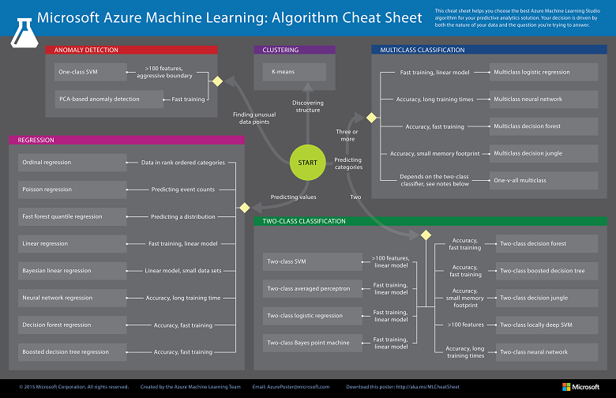
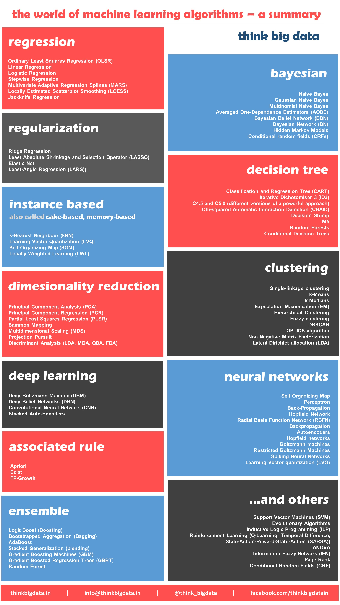
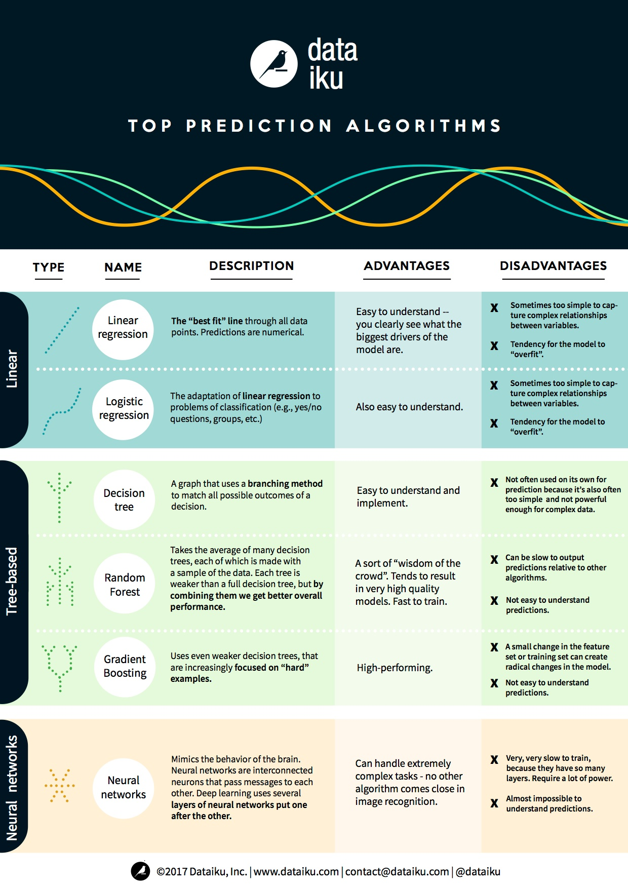

# 27个机器学习小抄

**本文导航**

机器学习					05%  

神经网络架构 			07%  

 微软 Azure 算法流程图 	10%  

SAS 算法流程图 			14%  

算法总结 				18%  

算法优劣 				26%  

Python 					30%  

算法 					31%  

Python基础 				35%  

Numpy 					41%  

Pandas 					52%  

Matplotlib 				61%  

Scikit Learn 				68%  

Tensorflow 				77%  

Pytorch 					81%  

数学					84%  

概率 					86%  

线性代数 				90%  

统计学 					93%  

微积分 					97%  

**[神经网络架构](file://ExternalFiles/The Neural Network Zoo - The Asimov Institute.html)**  

[http://www.asimovinstitute.org/neural-network-zoo/](http://www.asimovinstitute.org/neural-network-zoo/)  

  

**[微软Azure算法流程图](ExternalFiles/Machine learning algorithm cheat sheet _ Microsoft Docs.html)**  

[https://docs.microsoft.com/en-us/azure/machine-learning/machine-learning-algorithm-cheat-sheet](https://docs.microsoft.com/en-us/azure/machine-learning/machine-learning-algorithm-cheat-sheet)  

 

**[SAS算法流程图](ExternalFiles/Which machine learning algorithm should I use_ - Subconscious Musings.html)**  

[http://blogs.sas.com/content/subconsciousmusings/2017/04/12/machine-learning-algorithm-use/](http://blogs.sas.com/content/subconsciousmusings/2017/04/12/machine-learning-algorithm-use/)  

**[算法总结](ExternalFiles/A Tour of Machine Learning Algorithms.html)**  

[http://machinelearningmastery.com/a-tour-of-machine-learning-algorithms/](http://machinelearningmastery.com/a-tour-of-machine-learning-algorithms/)  

**[机器学习算法指引](ExternalFiles/Which are the best known machine learning algorithms_ Infographic - Think Big Data.html)**  

[http://thinkbigdata.in/best-known-machine-learning-algorithms-infographic/](http://thinkbigdata.in/best-known-machine-learning-algorithms-infographic/)  

**[算法优劣](ExternalFiles/Machine Learning Explained_ Algorithms Are Your Friend.html)**  

[https://blog.dataiku.com/machine-learning-explained-algorithms-are-your-friend](https://blog.dataiku.com/machine-learning-explained-algorithms-are-your-friend)  

**[算法](ExternalFiles/)**  

[https://www.analyticsvidhya.com/blog/2015/09/full-cheatsheet-machine-learning-algorithms/](https://www.analyticsvidhya.com/blog/2015/09/full-cheatsheet-machine-learning-algorithms/)  

