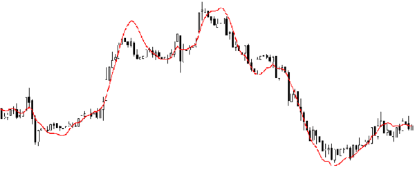

# 应该掌握的七种回归技术  
回归分析是建模和分析数据的重要工具。本文解释了回归分析的内涵及其优势，重点总结了应该掌握的线性回归、逻辑回归、多项式回归、逐步回归、岭回归、套索回归、ElasticNet回归等七种最常用的回归技术及其关键要素，最后介绍了选择正确的回归模型的关键因素。   

## 什么是回归分析？   
回归分析是一种预测性的建模技术，它研究的是因变量（目标）和自变量（预测器）之间的关系。这种技术通常用于预测分析，时间序列模型以及发现变量之间的因果关系。例如，司机的鲁莽驾驶与道路交通 事 故数量之间的关系，最好的研究方法就是回归。  

回归分析是建模和分析数据的重要工具。在这里，我们使用曲线/线来拟合这些数据点，在这种方式下，从曲线或线到数据点的距离差异最小。我会在接下来的部分详细解释这一点。  
  

## 我们为什么使用回归分析？   
如上所述，回归分析估计了两个或多个变量之间的关系。下面，让我们举一个简单的例子来理解它：   

比如说，在当前的经济条件下，你要估计一家公司的销售额增长情况。现在，你有公司最新的数据，这些数据显示出销售额增长大约是经济增长的2.5倍。那么使用回归分析，我们就可以根据当前和过去的信息来预测未来公司的销售情况。   

使用回归分析的好处良多。具体如下：   
1. 它表明自变量和因变量之间的显著关系；   
2. 它表明多个自变量对一个因变量的影响强度。   

回归分析也允许我们去比较那些衡量不同尺度的变量之间的相互影响，如价格变动与促销活动数量之间联系。这些有利于帮助市场研究人员，数据分析人员以及数据科学家排除并估计出一组最佳的变量，用来构建预测模型。  

## 我们有多少种回归技术？   
有各种各样的回归技术用于预测。这些技术主要有三个度量（自变量的个数，因变量的类型以及回归线的形状）。我们将在下面的部分详细讨论它们。   
  
对于那些有创意的人，如果觉得有必要使用上面这些参数的一个组合，甚至可以创造出一个没有被使用过的回归模型。  

### Linear Regression线性回归  
它是最为人熟知的建模技术之一。线性回归通常是人们在学习预测模型时首选的技术之一。在这种技术中，因变量是连续的，自变量可以是连续的也可以是离散的，回归线的性质是线性的。   

线性回归使用最佳的拟合直线（也就是回归线）在因变量（Y）和一个或多个自变量（X）之间建立一种关系。   

用一个方程式来表示它，即Y=a+b*X + e，其中a表示截距，b表示直线的斜率，e是误差项。这个方程可以根据给定的预测变量（s）来预测目标变量的值。   
  
一元线性回归和多元线性回归的区别在于，多元线性回归有（>1）个自变量，而一元线性回归通常只有1个自变量。现在的问题是“我们如何得到一个最佳的拟合线呢？”。   

#### 如何获得最佳拟合线（a和b的值）？   
这个问题可以使用最小二乘法轻松地完成。最小二乘法也是用于拟合回归线最常用的方法。对于观测数据，它通过最小化每个数据点到线的垂直偏差平方和来计算最佳拟合线。因为在相加时，偏差先平方，所以正值和负值没有抵消。  
  
我们可以使用R-square指标来评估模型性能。想了解这些指标的详细信息，可以阅读：模型性能指标  
要点：  
* 自变量与因变量之间必须有线性关系  
* 多元回归存在多重共线性，自相关性和异方差性。  
* 线性回归对异常值非常敏感。它会严重影响回归线，最终影响预测值。  
* 多重共线性会增加系数估计值的方差，使得在模型轻微变化下，估计非常敏感。结果就是系数估计值不稳定  
* 在多个自变量的情况下，我们可以使用向前选择法，向后剔除法和逐步筛选法来选择最重要的自变量。  

### Logistic Regression逻辑回归   
