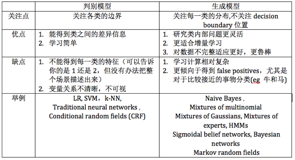

## 判断模型与生成模型  
生成模型：无穷样本 --> 概率密度模型 = 生成模型 --> 预测  
判别模型：有限样本 --> 判别函数 = 预测模型 --> 预测  
机器学习中的模型一般分为两类：判别模型、生成模型，这是对问题的两种不同的审视角度。  
假设我们要学习一个算法区分大象和狗（假设输入是重量、鼻子长度等特征）。判别模型和生成模型以两种不同的思路解决这个问题：  
* 判别模型：根据训练集，找到一个两种动物的一个差别（决策边界），然后根据输入的特征（比如重量，鼻子长度等）看这个特种落在决策边界的哪一边。
* 生成模型：根据大象的特征，学习一个大象的模型（总结一个大象长什么样的规律），然后也学习一个狗的模型，为了分类一个新的物种，我们看这个物种和哪个模型更加匹配。

### 决策函数Y=f(X)或者条件概率分布P(Y|X)  
&emsp;&emsp;监督学习的任务就是从数据中学习一个模型（也叫分类器），应用这一模型，对给定的输入X预测相应的输出Y。这个模型的一般形式为决策函数Y=f(X)或者条件概率分布P(Y|X)。  
&emsp;&emsp;决策函数Y=f(X)：你输入一个X，它就输出一个Y，这个Y与一个阈值比较，根据比较结果判定X属于哪个类别。例如两类（w1和w2）分类问题，如果Y大于阈值，X就属于类w1，如果小于阈值就属于类w2。这样就得到了该X对应的类别了。  
&emsp;&emsp;条件概率分布P(Y|X)：你输入一个X，它通过比较它属于所有类的概率，然后输出概率最大的那个作为该X对应的类别。例如：如果P(w1|X)大于P(w2|X)，那么我们就认为X是属于w1类的。  
&emsp;&emsp;所以上面两个模型都可以实现对给定的输入X预测相应的输出Y的功能。实际上通过条件概率分布P(Y|X)进行预测也是隐含着表达成决策函数Y=f(X)的形式的。例如也是两类w1和w2，那么我们求得了P(w1|X)和P(w2|X)，那么实际上判别函数就可以表示为Y= P(w1|X)/P(w2|X)，如果Y大于1或者某个阈值，那么X就属于类w1，如果小于阈值就属于类w2。而同样，很神奇的一件事是，实际上决策函数Y=f(X)也是隐含着使用P(Y|X)的。因为一般决策函数Y=f(X)是通过学习算法使你的预测和训练数据之间的误差平方最小化，而贝叶斯告诉我们，虽然它没有显式的运用贝叶斯或者以某种形式计算概率，但它实际上也是在隐含的输出极大似然假设（MAP假设）。也就是说学习器的任务是在所有假设模型有相等的先验概率条件下，输出极大似然假设。  
&emsp;&emsp;所以呢，分类器的设计就是在给定训练数据的基础上估计其概率模型P(Y|X)。如果可以估计出来，那么就可以分类了。但是一般来说，概率模型是比较难估计的。给一堆数据，特别是数据不多的时候，一般很难找到这些数据满足什么规律。那能否不依赖概率模型直接设计分类器呢？事实上，分类器就是一个决策函数（或决策面），如果能够从要解决的问题和训练样本出发直接求出判别函数，就不用估计概率模型了，这就是决策函数Y=f(X)的伟大使命了。例如支持向量机，我已经知道它的决策函数（分类面）是线性的了，也就是可以表示成Y=f(X)=WX+b的形式，那么我们通过训练样本来学习得到W和b的值就可以得到Y=f(X)了。还有一种更直接的分类方法，它不用事先设计分类器，而是只确定分类原则，根据已知样本（训练样本）直接对未知样本进行分类。包括近邻法，它不会在进行具体的预测之前求出概率模型P(Y|X)或者决策函数Y=f(X)，而是在真正预测的时候，将X与训练数据的各类的Xi比较，和哪些比较相似，就判断它X也属于Xi对应的类。  

### 生成方法和判别方法  
&emsp;&emsp;监督学习方法又分生成方法（Generative approach）和判别方法（Discriminative approach），所学到的模型分别称为生成模型（Generative Model）和判别模型（Discriminative Model）。咱们先谈判别方法，因为它和前面说的都差不多，比较容易明白。  
&emsp;&emsp;判别方法：由数据直接学习决策函数Y=f(X)或者条件概率分布P(Y|X)作为预测的模型，即判别模型。基本思想是有限样本条件下建立判别函数，不考虑样本的产生模型，直接研究预测模型。典型的判别模型包括k近邻，感知级，决策树，支持向量机等。  
&emsp;&emsp;生成方法：由数据学习联合概率密度分布P(X,Y)，然后求出条件概率分布P(Y|X)作为预测的模型，即生成模型：P(Y|X)= P(X,Y)/ P(X)。基本思想是首先建立样本的联合概率概率密度模型P(X,Y)，然后再得到后验概率P(Y|X)，再利用它进行分类，就像上面说的那样。注意了哦，这里是先求出P(X,Y)才得到P(Y|X)的，然后这个过程还得先求出P(X)。P(X)就是训练数据的概率分布。只有数据样本非常多的时候，得到的P(X)才能很好的描述你数据真正的分布。例如投硬币，试了100次，得到正面的次数和试验次数的比可能是3/10，然后你直觉告诉你，可能不对，然后再试了500次，这次正面的次数和试验次数的比可能就变成4/10，这时候你半信半疑，所以再试200000次，这时候正面的次数和试验次数的比（就可以当成是正面的概率了）就变成5/10了。  
&emsp;&emsp;还有一个问题就是，在机器学习领域有个约定俗成的说法是：不要去学那些对这个任务没用的东西。例如，对于一个分类任务：对一个给定的输入x，将它划分到一个类y中。那么，如果我们用生成模型：p(x,y)=p(y|x).p(x)，我们就需要去对p(x)建模，但这增加了我们的工作量，这让我们很不爽（除了上面说的那个估计得到P(X)可能不太准确外）。实际上，因为数据的稀疏性，导致我们都是被强迫地使用弱独立性假设去对p(x)建模的，所以就产生了局限性。所以我们更趋向于直观的使用判别模型去分类。  
&emsp;&emsp;这样的方法之所以称为生成方法，是因为模型表示了给定输入X产生输出Y的生成关系。用于随机生成的观察值建模，特别是在给定某些隐藏参数情况下。典型的生成模型有：朴素贝叶斯和隐马尔科夫模型等。

### 判别模型(Discriminative Model)  
&emsp;&emsp;直接学习的是决策函数y = f(x) 或者条件概率p(y|x) （或者输入X和label{0,1}的一种映射关系），利用正负例和分类标签，关注在判别模型的边缘分布。更多用来直接解决给定的问题，而不侧重于建模。建模的目标是：   
  

#### 主要特点  
&emsp;&emsp;寻找不同类别之间的最优分类面，反映的是异类数据之间的差异。  
&emsp;&emsp;判别方法直接学习的是决策函数Y=f(X)或者条件概率分布P(Y|X)。不能反映训练数据本身的特性。但它寻找不同类别之间的最优分类面，反映的是异类数据之间的差异。直接面对预测，往往学习的准确率更高。由于直接学习P(Y|X)或P(X)，可以对数据进行各种程度上的抽象、定义特征并使用特征，因此可以简化学习问题。  

#### 优点  
* 分类边界更灵活，比使用纯概率方法或生产模型得到的更高级。  
* 能清晰的分辨出多类或某一类与其他类之间的差异特征。  
* 在聚类，viewpoint changes, partial occlusion and scale variations中的效果较好。  
* 适用于较多类别的识别。  
* 判别模型的性能比生成模型要简单，比较容易学习。  

#### 缺点  
* 不能反映训练数据本身的特性，能力有限，可以告诉你的是1还是2，但没办法把整个场景描述出来。  
* 形式和结构上不如生成式模型优雅。  
* 类似于黑盒，变量之间的关系不明确。 
 
#### 常见判别模型  
* 逻辑回归  
* svm  
* 传统的神经网络  
* Nearest Neighbor  
* GRF(条件随机场)  
* LDA(线性判别分析)  
* Boosting  
* 线性回归  
* k近邻  
* 最大熵模型

### 生成模型(Generative Model)
&emsp;&emsp;学习的是联合概率p(x,y), 由于p(x,y) = p(x|y)*p(y), 即我们需要学习的是p(x|y)和p(y), 就上面给的例子，如果y表示一个动物是狗(y=0)或者大象(y=1)，那么p(x|y=0)对狗的特征进行建模，p(x|y=1)是对大象的特征进行建模，p(y)可以假设其服从伯努利分布（因为y只有0,1两种取值）。建模目标如下：  
  
上面的式子之所以可以忽略p(x)，因为对训练集的输入x来说p(x)是一个常量。模型训练好以后对于输入的x，我们可以根据一下贝叶斯公式来计算P(y|x), 然后看p(y=0|x)和p(y=1|x)哪个较大，就划分给那一类  
  
(即生成模型和判别模型的最终目标都是p(y|x)，只不过生成模型的目标转换成了另一种形式)  

#### 主要特点  
&emsp;&emsp;一般主要是对后验概率建模，从统计的角度表示数据的分布情况，能够反映同类数据本身的相似度； 只关注自己的 inclass 本身，不关心到底 decision boundary 在哪。  
&emsp;&emsp;生成方法学习联合概率密度分布P(X,Y)，所以就可以从统计的角度表示数据的分布情况，能够反映同类数据本身的相似度。但它不关心到底划分各类的那个分类边界在哪。生成方法可以还原出联合概率分布P(Y,X)，而判别方法不能。生成方法的学习收敛速度更快，即当样本容量增加的时候，学到的模型可以更快的收敛于真实模型，当存在隐变量时，仍可以用生成方法学习。此时判别方法就不能用。  

#### 优点  
* 实际上带的信息要比判别模型丰富，有更强的解释力。  
* 研究单类问题比判别模型灵活性强。  
* 模型可以通过增量学习得到。  
* 能用于数据不完整的情况。  

#### 缺点
* 学习和计算过程比较复杂。  

#### 常见生成模型  
* GDA(高斯判别分析)  
* 朴素贝叶斯  
* 贝叶斯网络  
* Mixtures of Multinomials  
* 高斯混合模型  
* Mixtures of Experts  
* 隐马尔科夫模型  
* Sigmoidal Belief Networks  
* 马尔科夫随机场  
* LDA(潜在狄立克雷分配)

  

#####　二者联系　　
由生成模型可以得到判别模型，但由判别模型得不到生成模型。

### 举例  
例如我们有一个输入数据x，然后我们想将它分类为标签y。  
```
生成模型学习联合概率分布p(x,y)，而判别模型学习条件概率分布p(y|x)。
```
下面是个简单的例子：  
例如我们有以下(x,y)形式的数据：(1,0), (1,0), (2,0), (2, 1)  
那么p(x,y)是：  

&emsp;&emsp; | y=0 | y=1
------------ | ------------- | -------------
x=1 | 1/2 | 0
x=2 | 1/4 | 1/4

而p(y|x) 是：  

&emsp;&emsp; | y=0 | y=1
------------ | ------------- | -------------
x=1 | 1 | 0
x=2 | 1/2 | 1/2

&emsp;&emsp;我们为了将一个样本x分类到一个类y，最自然的做法就是条件概率分布p(y|x)，这就是为什么我们对其直接求p(y|x)方法叫做判别算法。而生成算法求p(x,y)，而p(x,y)可以通过贝叶斯方法转化为p(y|x)，然后再用其分类。但是p(x,y)还有其他作用，例如，你可以用它去生成(x,y)对。  
&emsp;&emsp;再假如你的任务是识别一个语音属于哪种语言。例如对面一个人走过来，和你说了一句话，你需要识别出她说的到底是汉语、英语还是法语等。那么你可以有两种方法达到这个目的：  
1. 学习每一种语言，你花了大量精力把汉语、英语和法语等都学会了，指的学会是你知道什么样的语音对应什么样的语言。然后再有人过来对你说，你就可以知道他说的是什么语音。  
2. 不去学习每一种语言，你只学习这些语言模型之间的差别，然后再分类。意思是指学会了汉语和英语等语言的发音是有差别的，学会这种差别就好了。  

```
那么第一种方法就是生成方法，第二种方法是判别方法。  
生成算法尝试去找到底这个数据是怎么生成的（产生的），然后再对一个信号进行分类。基于你的生成假设，那么那个类别最有可能产生这个信号，这个信号就属于那个类别。判别模型不关心数据是怎么生成的，它只关心信号之间的差别，然后用差别来简单对给定的一个信号进行分类。
```

### 跟踪算法  
&emsp;&emsp;跟踪算法一般来说可以分为两类：基于外观模型的生成模型或者基于外观模型的判别模型。  
&emsp;&emsp;生成模型：一般是学习一个代表目标的模型，然后通过它去搜索图像区域，然后最小化重构误差。类似于生成模型描述一个目标，然后就是模式匹配了，在图像中找到和这个模型最匹配的区域，就是目标了。  
&emsp;&emsp;判别模型：将跟踪问题看成一个二分类问题，然后找到目标和背景的决策边界。它不管目标是怎么描述的，那只要知道目标和背景的差别在哪，然后你给一个图像，它看它处于边界的那一边，就归为哪一类。

##### 参考  
* [生成模型与判别模型](http://blog.csdn.net/zouxy09/article/details/8195017)
* [判别模型、生成模型与朴素贝叶斯方法](http://www.cnblogs.com/jerrylead/archive/2011/03/05/1971903.html)
* [判别式模型与生成式模型](http://www.leexiang.com/discriminative-model-and-generative-model)
* [判别模型和生成模型](http://blog.sina.com.cn/s/blog_b09d46020101dfq0.html)
* [机器学习：判别模型与生成模型](http://www.cnblogs.com/TenosDoIt/p/3721074.html)