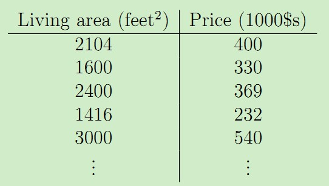
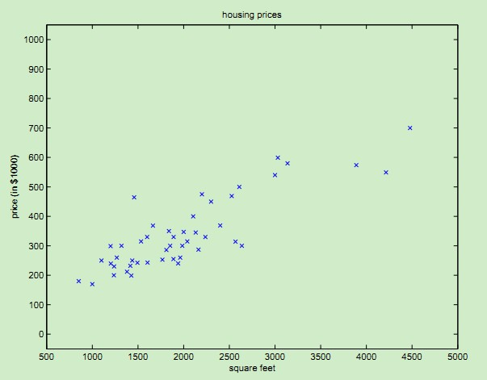
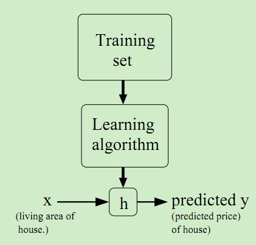

## 引言  
&emsp;&emsp;本材料参考[Andrew Ng大神的机器学习课程](http://cs229.stanford.edu)，以及[斯坦福无监督学习UFLDL tutorial](http://ufldl.stanford.edu/wiki/index.php/UFLDL_Tutorial)。  
&emsp;&emsp;机器学习中的回归问题属于监督学习的范畴。回归问题的目标是给定D维输入变量x，并且每一个输入矢量x都有对应的值y，要求对于新来的数据预测它对应的连续的目标值t。比如下面这个例子：假设我们有一个包含47个房子的面积和价格的数据集如下：  
  
我们可以在Matlab中画出来这组数据集，如下：  
  
看到画出来的点，是不是有点像一条直线？我们可以用一条曲线去尽量拟合这些数据点，那么对于新来的输入，我么就可以将拟合的曲线上返回对应的点从而达到预测的目的。如果要预测的值是连续的比如上述的房价，那么就属于回归问题；如果要预测的值是离散的即一个个标签，那么就属于分类问题。这个学习处理过程如下图所示：  
  
上述学习过程中的常用术语：包含房子面积和价格的数据集称为训练集training set；输入变量x（本例中为面积）为特征features；输出的预测值y（本例中为房价）为目标值target；拟合的曲线，一般表示为y = h(x)，称为假设模型hypothesis；训练集的条目数称为特征的维数，本例为47。  

## 线性回归模型  
线性回归模型假设输入特征和对应的结果满足线性关系。在上述的数据集中加上一维--房间数量，于是数据集变为：