# 27个机器学习小抄

**本文导航**

机器学习					05%  

神经网络架构 			07%  

 微软 Azure 算法流程图 	10%  

SAS 算法流程图 			14%  

算法总结 				18%  

算法优劣 				26%  

Python 					30%  

算法 					31%  

Python基础 				35%  

Numpy 					41%  

Pandas 					52%  

Matplotlib 				61%  

Scikit Learn 				68%  

Tensorflow 				77%  

Pytorch 					81%  

数学					84%  

概率 					86%  

线性代数 				90%  

统计学 					93%  

微积分 					97%  

**[神经网络架构](file://ExternalFiles/The Neural Network Zoo - The Asimov Institute.html)**  

[http://www.asimovinstitute.org/neural-network-zoo/](http://www.asimovinstitute.org/neural-network-zoo/)  

  

**[微软Azure算法流程图](ExternalFiles/Machine learning algorithm cheat sheet _ Microsoft Docs.html)**  

[https://docs.microsoft.com/en-us/azure/machine-learning/machine-learning-algorithm-cheat-sheet](https://docs.microsoft.com/en-us/azure/machine-learning/machine-learning-algorithm-cheat-sheet)  

 

**[SAS算法流程图](ExternalFiles/Which machine learning algorithm should I use_ - Subconscious Musings.html)**  

[http://blogs.sas.com/content/subconsciousmusings/2017/04/12/machine-learning-algorithm-use/](http://blogs.sas.com/content/subconsciousmusings/2017/04/12/machine-learning-algorithm-use/)  

**[算法总结](ExternalFiles/A Tour of Machine Learning Algorithms.html)**  

[http://machinelearningmastery.com/a-tour-of-machine-learning-algorithms/](http://machinelearningmastery.com/a-tour-of-machine-learning-algorithms/)  

**[机器学习算法指引](ExternalFiles/Which are the best known machine learning algorithms_ Infographic - Think Big Data.html)**  

[http://thinkbigdata.in/best-known-machine-learning-algorithms-infographic/](http://thinkbigdata.in/best-known-machine-learning-algorithms-infographic/)  

**[算法优劣](ExternalFiles/Machine Learning Explained_ Algorithms Are Your Friend.html)**  

[https://blog.dataiku.com/machine-learning-explained-algorithms-are-your-friend](https://blog.dataiku.com/machine-learning-explained-algorithms-are-your-friend)  

**[算法](ExternalFiles/)**  

[https://www.analyticsvidhya.com/blog/2015/09/full-cheatsheet-machine-learning-algorithms/](https://www.analyticsvidhya.com/blog/2015/09/full-cheatsheet-machine-learning-algorithms/)  

**[Python基础](ExternalFiles/pythonbase.pdf)**  

[http://datasciencefree.com/python.pdf](http://datasciencefree.com/python.pdf)  

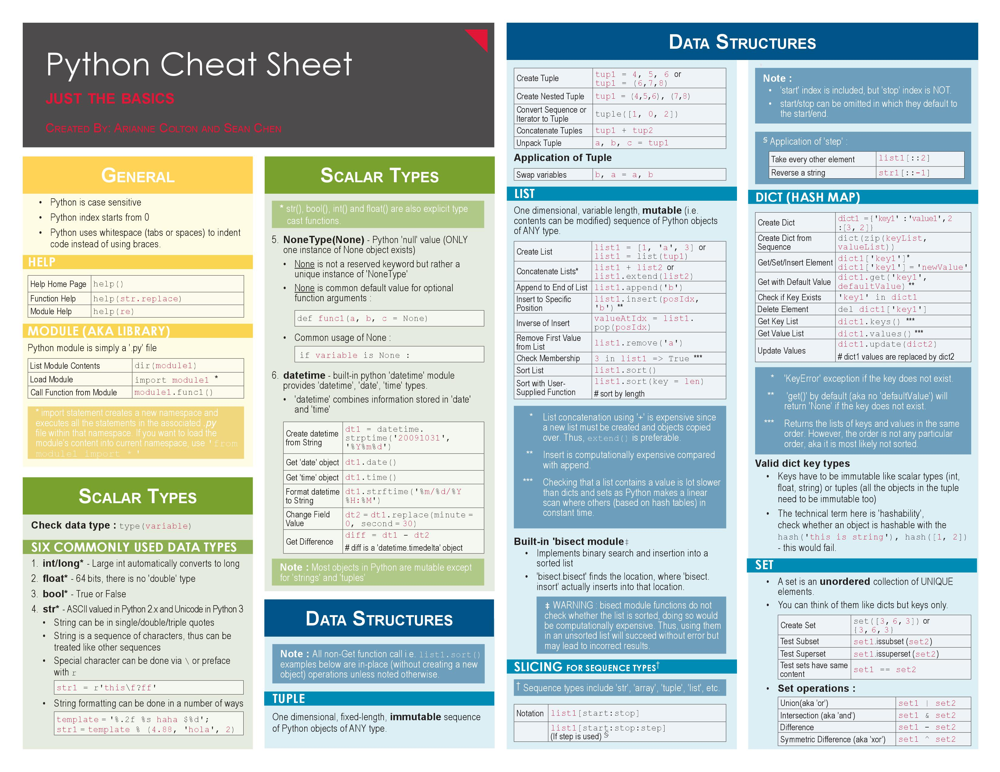  

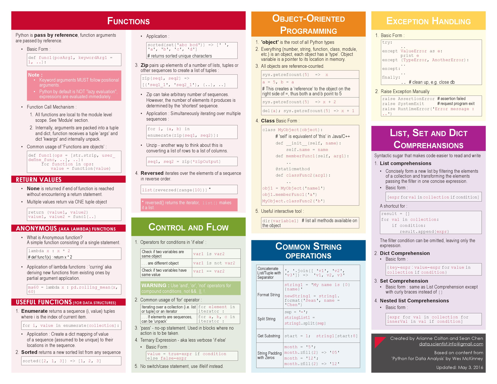  

**[数据科学Python入门备忘单](ExternalFiles/Python For Data Science - A Cheat Sheet For Beginners (Article).mhtml)**  

[https://www.datacamp.com/community/tutorials/python-data-science-cheat-sheet-basics#gs.0x1rxEA](https://www.datacamp.com/community/tutorials/python-data-science-cheat-sheet-basics#gs.0x1rxEA)  

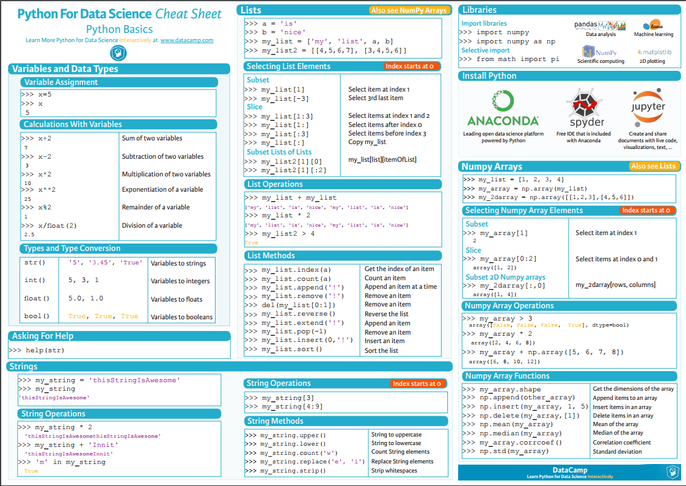  

**[NumPy Cheat Sheet - Python for Data Science](ExternalFiles/NumPy Cheat Sheet - Python for Data Science.mhtml)**  

[https://www.dataquest.io/blog/numpy-cheat-sheet/](https://www.dataquest.io/blog/numpy-cheat-sheet/)  

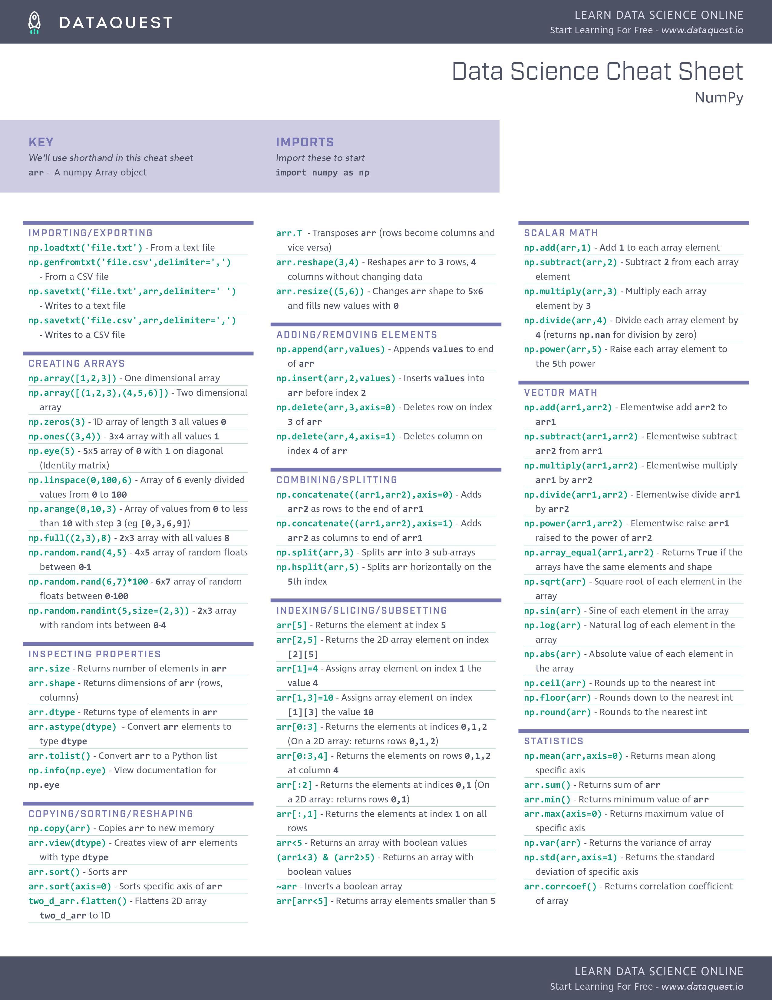  

**[Numpy Cheat Sheet](ExternalFiles/numpy.pdf)**  

[http://datasciencefree.com/numpy.pdf](http://datasciencefree.com/numpy.pdf)  

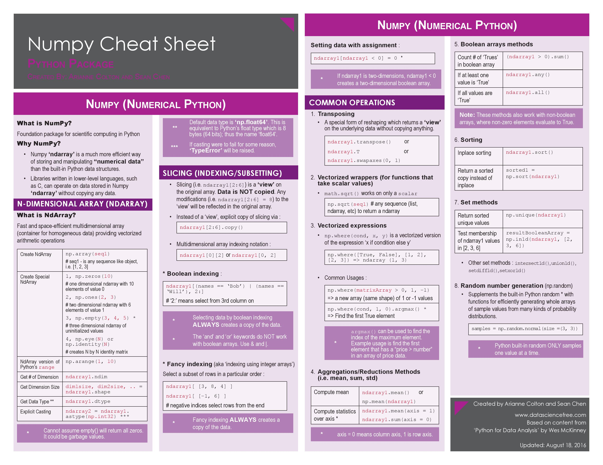  

**[NumPy Cheat Sheet: Data Analysis in Python](ExternalFiles/NumPy Cheat Sheet_ Data Analysis in Python (Article).mhtml)**  

[https://www.datacamp.com/community/blog/python-numpy-cheat-sheet#gs.upAzjtI](https://www.datacamp.com/community/blog/python-numpy-cheat-sheet#gs.upAzjtI)  

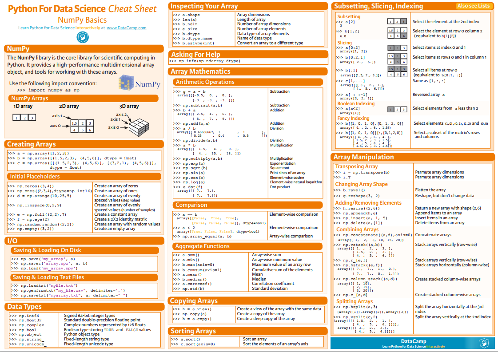  

**[Data Analysis with Pandas](ExternalFiles/pandas.pdf)**    

[http://datasciencefree.com/pandas.pdf](http://datasciencefree.com/pandas.pdf)  

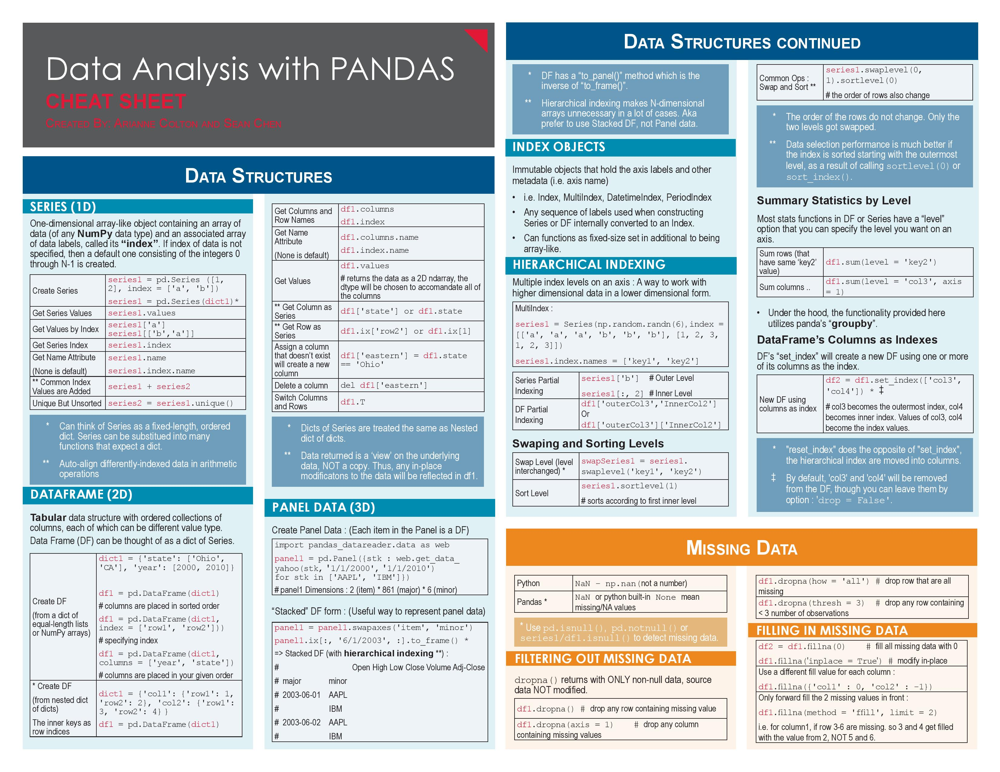  

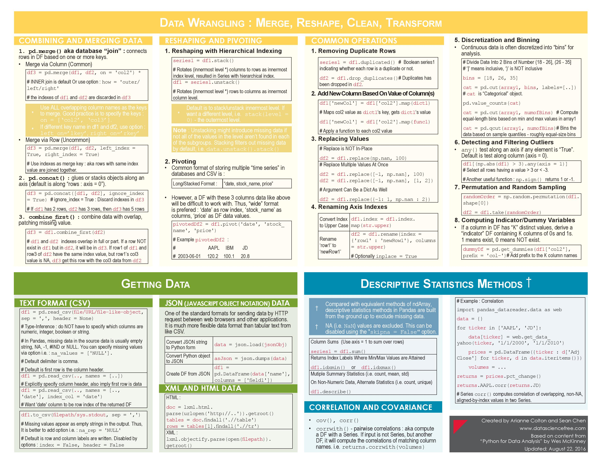  

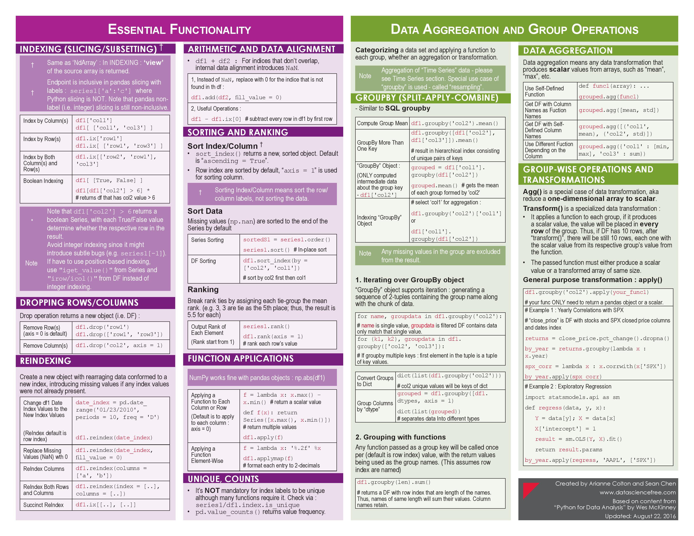  

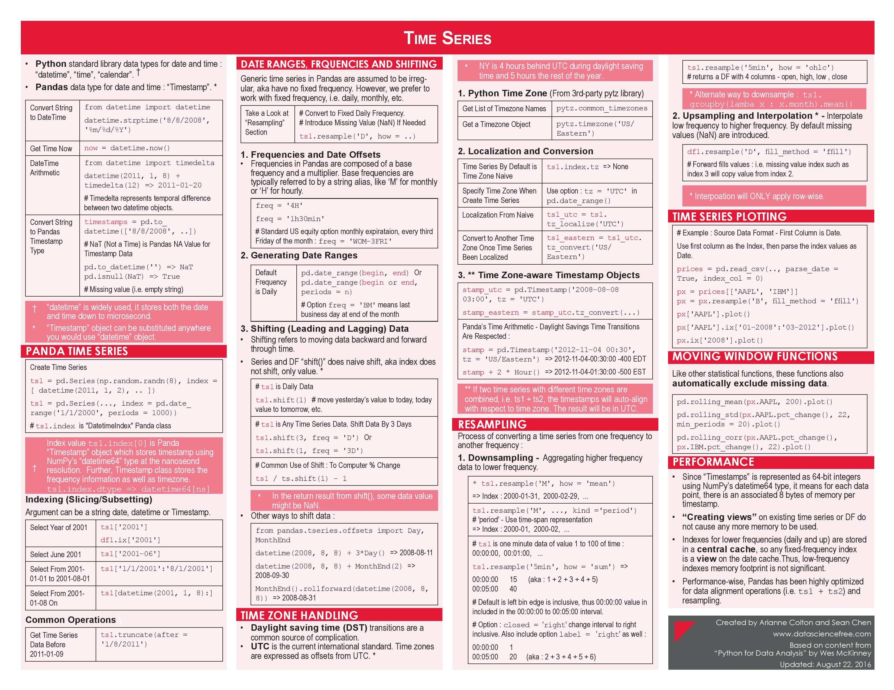 

**[Pandas Cheat Sheet for Data Science in Python](ExternalFiles/Pandas Cheat Sheet for Data Science in Python (Article).mhtml)**  

[https://www.datacamp.com/community/blog/python-pandas-cheat-sheet#gs. S4P4T=U](https://www.datacamp.com/community/blog/python-pandas-cheat-sheet#gs. S4P4T=U)  

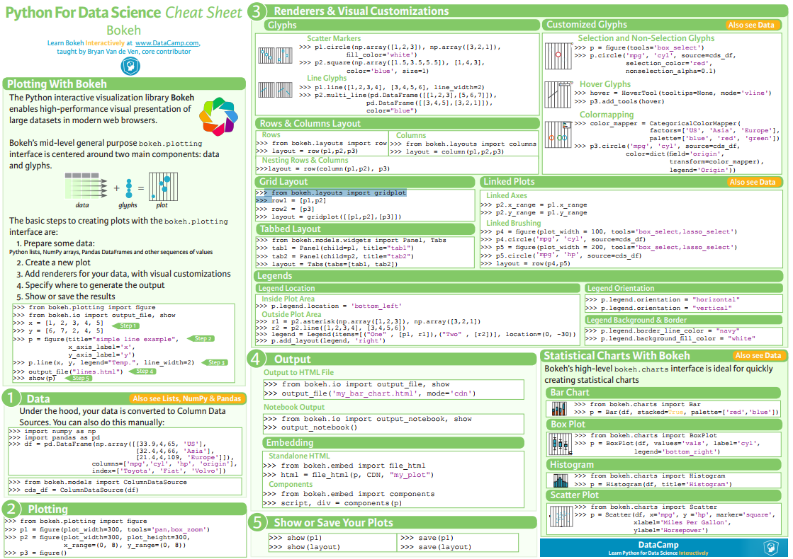    

**[Matplotlib Cheat Sheet: Plotting in Python](ExternalFiles/Matplotlib Cheat Sheet_ Plotting in Python (Article).mhtml)**  

[https://www.datacamp.com/community/blog/python-matplotlib-cheat-sheet#gs.saDpv2o](https://www.datacamp.com/community/blog/python-matplotlib-cheat-sheet#gs.saDpv2o)  

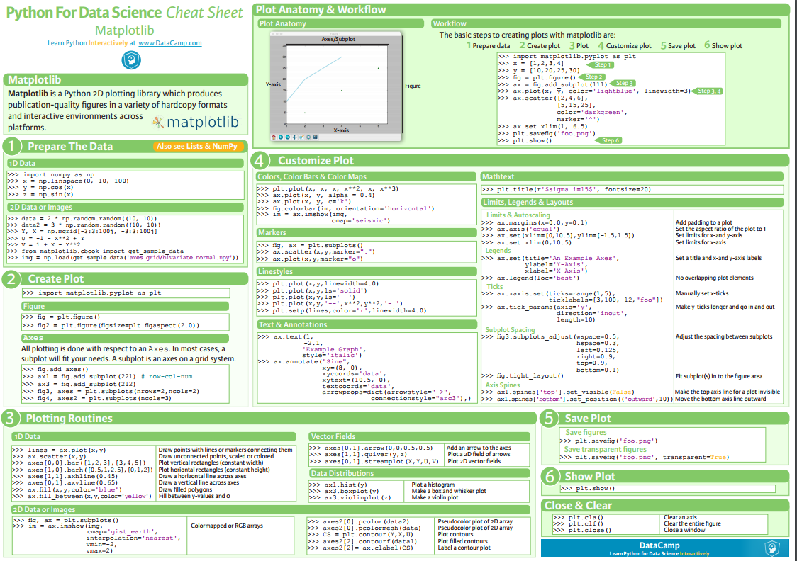  

**[Scikit Learn](ExternalFiles/Scikit-Learn Cheat Sheet_ Python Machine Learning (Article).mhtml)**  

[https://www.datacamp.com/community/blog/scikit-learn-cheat-sheet#gs.fZ2A1Jk](https://www.datacamp.com/community/blog/scikit-learn-cheat-sheet#gs.fZ2A1Jk)  

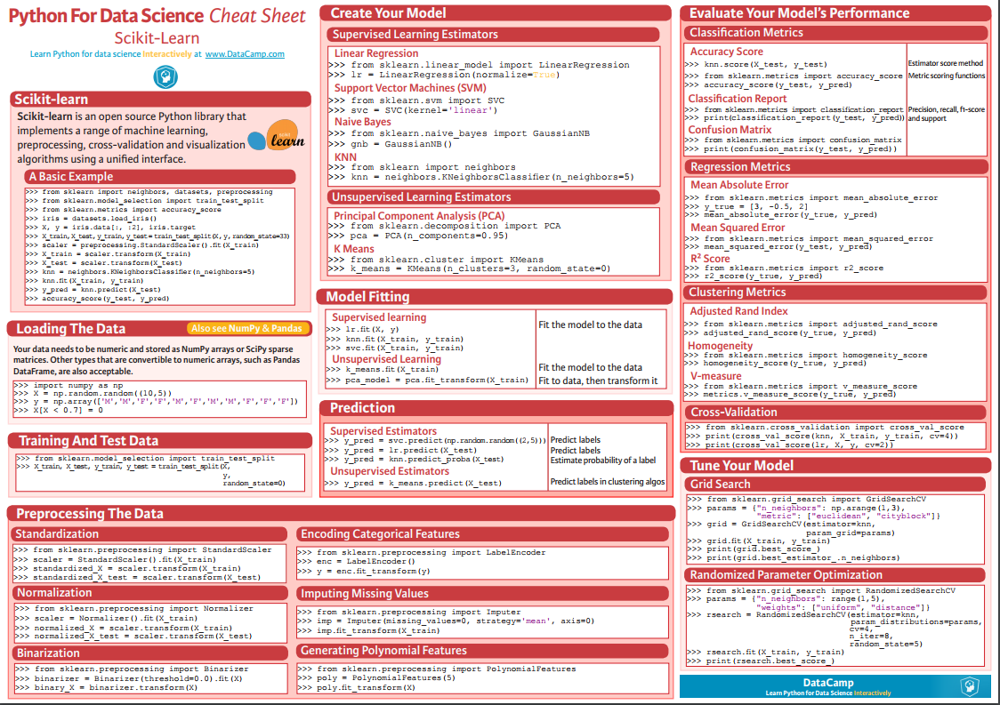  

**[Machine Learning Cheat Sheet (for scikit-learn)](ExternalFiles/Peekaboo_ Machine Learning Cheat Sheet (for scikit-learn).mhtml)**  

[http://peekaboo-vision.blogspot.jp/2013/01/machine-learning-cheat-sheet-for-scikit.html](http://peekaboo-vision.blogspot.jp/2013/01/machine-learning-cheat-sheet-for-scikit.html)  

  

### 原文地址  

[ https://unsupervisedmethods.com/cheat-sheet-of-machine-learning-and-python-and-math-cheat-sheets-a4afe4e791b6]( https://unsupervisedmethods.com/cheat-sheet-of-machine-learning-and-python-and-math-cheat-sheets-a4afe4e791b6)    

### 中文地址  

[http://blog.csdn.net/wemedia/details.html?id=42718](http://blog.csdn.net/wemedia/details.html?id=42718)  