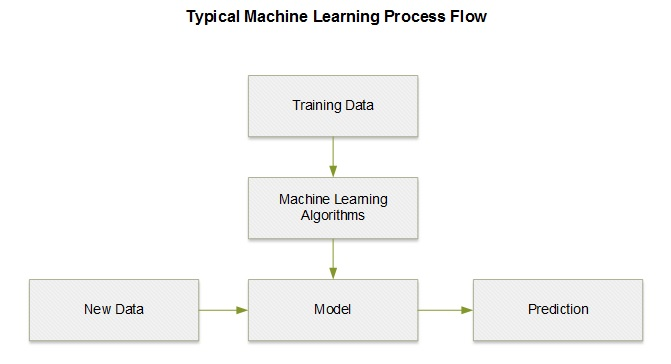
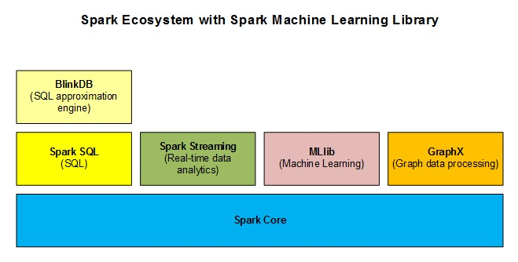
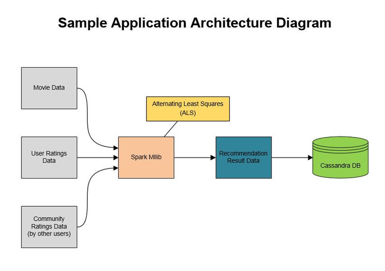
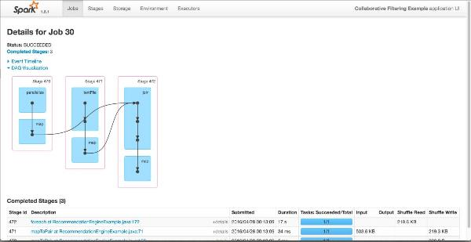

# 用Spark进行大数据处理之机器学
## 引言  
spark机器学习API包含两个package：spark.mllib和spark.ml。  

[spark.mllib](http://spark.apache.org/docs/latest/mllib-guide.html) 包含基于弹性数据集（RDD）的原始Spark机器学习API。它提供的机器学习技术有：相关性、分类和回归、协同过滤、聚类和数据降维。  

spark.ml提供建立在[DataFrame](http://spark.apache.org/docs/latest/sql-programming-guide.html#dataframes)的机器学习API，DataFrame是Spark SQL的核心部分。这个包提供开发和管理机器学习管道的功能，可以用来进行特征提取、转换、选择器和机器学习算法，比如分类和回归和聚类。  

本篇文章聚焦在Spark MLlib上，并讨论各个机器学习算法。下篇文章将讲述Spark ML以及如何创建和管理数据管道。  

## 机器学习和数据科学  
机器学习是从已经存在的数据进行学习来对将来进行数据预测，它是基于输入数据集创建模型做数据驱动决策。  

数据科学是从海里数据集（结构化和非结构化数据）中抽取知识，为商业团队提供数据洞察以及影响商业决策和路线图。数据科学家的地位比以前用传统数值方法解决问题的人要重要。  

以下是几类机器学习模型：  
* 监督学习模型  
* 非监督学习模型  
* 半监督学习模型  
* 增强学习模型  

下面简单的了解下各机器学习模型，并进行比较：  
* 监督学习模型：监督学习模型对已标记的训练数据集训练出结果，然后对未标记的数据集进行预测；  
  监督学习又包含两个子模型：回归模型和分类模型。  
* 非监督学习模型：非监督学习模型是用来从原始数据（无训练数据）中找到隐藏的模式或者关系，因而非监督学习模型是基于未标记数据集的；  
* 半监督学习模型：半监督学习模型用在监督和非监督机器学习中做预测分析，其既有标记数据又有未标记数据。典型的场景是混合少量标记数据和大量未标记数据。半监督学习一般使用分类和回归的机器学习方法；  
* 增强学习模型：增强学习模型通过不同的行为来寻找目标回报函数最大化。  

下面给各个机器学习模型举个列子：  
* 监督学习：异常监测；  
* 非监督学习：社交网络，语言预测；  
* 半监督学习：图像分类、语音识别；    
* 增强学习：人工智能（AI）。  

## 机器学习项目步骤  
开发机器学习项目时，数据预处理、清洗和分析的工作是非常重要的，与解决业务问题的实际的学习模型和算法一样重要。  
典型的机器学习解决方案的一般步骤：  
* 特征工程  
* 模型训练  
* 模型评估  

  
原始数据如果不能清洗或者预处理，则会造成最终的结果不准确或者不可用，甚至丢失重要的细节。  

训练数据的质量对最终的预测结果非常重要，如果训练数据不够随机，得出的结果模型不精确；如果数据量太小，机器学习出的模型也不准确。  

使用案例：  
业务使用案例分布于各个领域，包括个性化推荐引擎（[食品推荐引擎](https://chimpler.wordpress.com/2014/07/22/building-a-food-recommendation-engine-with-spark-mllib-and-play/)），数据预测分析（[股价预测](http://eugenezhulenev.com/blog/2014/11/14/stock-price-prediction-with-big-data-and-machine-learning/)或者[预测航班延迟](http://eugenezhulenev.com/blog/2014/11/14/stock-price-prediction-with-big-data-and-machine-learning/)），广告，异常监测，图像和视频模型识别，以及其他各类人工智能  。
接着来看两个比较流行的机器学习应用：个性化推荐引擎和异常监测。  

### 推荐引擎  
个性化推荐引擎使用商品属性和用户行为来进行预测。推荐引擎一般有两种算法实现：基于内容过滤和协同过滤。  
协调过滤的解决方案比其他算法要好，Spark MLlib实现了[ALS协同过滤算法](http://spark.apache.org/docs/latest/mllib-collaborative-filtering.html)。Spark MLlib的协同过滤有两种形式：[显式反馈和隐试反馈](http://spark.apache.org/docs/latest/mllib-collaborative-filtering.html#explicit-vs-implicit-feedback)。显式反馈是基于用户购买的商品（比如，电影），显式反馈虽好，但很多情况下会出现数据倾斜；隐试反馈是基于用户的行为数据，比如，浏览、点击、喜欢等行为。隐试反馈现在大规模应用在工业上进行数据预测分析，因为其很容易收集各类数据。  
另外有基于模型的方法实现推荐引擎，这里暂且略过。  

### 异常监测　　
异常监测是机器学习中另外一个应用非常广泛的技术，因为其可以快速和准确地解决金融行业的棘手问题。金融服务业需要在几百毫秒内判断出一笔在线交易是否非法。  
神经网络技术被用来进行销售点的异常监测。比如像PayPal等公司使用不同的机器学习算法（比如，线性回归，神经网络和深度学习）来进行风险管理。  
Spark MLlib库提供给了几个实现的算法，比如，线性SVM、逻辑回归、决策树和贝叶斯算法。另外，一些集成模型，比如随机森林和gradient-boosting树。  

## Spark MLlib  
Spark MLlib实现的机器学习库使得机器学习模型可扩展和易使用，包括分类算法、回归算法、聚类算法、协同过滤算法、降维算法，并提供了相应的API。除了这些算法外，Spark MLlib还提供了各种数据处理功能和数据分析工具为大家使用：
* 通过FP-growth算法进行频繁项集挖掘和关联分析；  
* 通过PrefixSpan算法进行序列模式挖掘；  
* 提供概括性统计和假设检验；  
* 提供特征转换；  
* 机器学习模型评估和超参数调优。  

  

### Spark MLlib应用实践  
使用Spark MLlib实现推荐引擎。推荐引擎最佳实践是基于已知用户的商品行为而去预测用户可能感兴趣的未知商品。推荐引擎基于已知数据（也即，训练数据）训练出预测模型。然后利用训练好的预测模型来预测。  
最佳电影推荐引擎的实现有下面几步：  
* 加载电影数据；  
* 加载你指定的评价数据；  
* 加载社区提供的评价数据；  
* 将评价数据join成单个RDD；  
* 使用ALS算法训练模型；  
* 确认指定用户（userId ＝ 1）未评价的电影；  
* 预测未被用户评价的电影的评价；  
* 获取Top N的推荐（这里N＝ 5）；  
* 在终端显示推荐结果。  
如果你想对输出的数据做进一步分析，你可以把预测的结果存储到Cassandra或者MongoDB等数据库。  

### 使用到的技术  
这里采用Java开发Spark MLlib程序，并在stand－alone模型下执行。使用到的MLlib Java类：org.apache.spark.mllib.recommendation。
* ALS 
* MatrixFactorizationModel  
* Rating  

  
程序执行：  
开发好的程序进行打包，设置环境变量：JDK (JAVA_HOME), Maven (MAVEN_HOME)和Spark (SPARK_HOME)。
在Windows环境中：  
```
set JAVA_HOME=[JDK_INSTALL_DIRECTORY]
set PATH=%PATH%;%JAVA_HOME%\bin

set MAVEN_HOME=[MAVEN_INSTALL_DIRECTORY]
set PATH=%PATH%;%MAVEN_HOME%\bin

set SPARK_HOME=[SPARK_INSTALL_DIRECTORY]
set PATH=%PATH%;%SPARK_HOME%\bin

cd c:\dev\projects\spark-mllib-sample-app
mvn clean install
mvn eclipse:clean eclipse:eclipse
```  

在Linux或者Mac系统中：  
```
export JAVA_HOME=[JDK_INSTALL_DIRECTORY]
export PATH=$PATH:$JAVA_HOME/bin

export MAVEN_HOME=[MAVEN_INSTALL_DIRECTORY]
export PATH=$PATH:$MAVEN_HOME/bin

export SPARK_HOME=[SPARK_INSTALL_DIRECTORY]
export PATH=$PATH:$SPARK_HOME/bin

cd /Users/USER_NAME/spark-mllib-sample-app

mvn clean install
mvn eclipse:clean eclipse:eclipse
```  

运行Spark程序，命令如下：  
在Windows环境下：  
```
%SPARK_HOME%\bin\spark-submit --class "org.apache.spark.examples.mllib.JavaRecommendationExample" --master local[*] target\spark-mllib-sample-1.0.jar
```  

在Linux或者Mac环境下：  
```
$SPARK_HOME/bin/spark-submit --class "org.apache.spark.examples.mllib.JavaRecommendationExample" --master local[*] target/spark-mllib-sample-1.0.jar  
```

### Spark MLlib应用监控  
使用Spark的web控制台可以进行监控程序运行状态。这里只给出程序运行的有向无环图（DAG）：  


## 参考
中文：[http://www.infoq.com/cn/articles/apache-spark-machine-learning](http://www.infoq.com/cn/articles/apache-spark-machine-learning)  
英文：[https://www.infoq.com/articles/apache-spark-machine-learning](https://www.infoq.com/articles/apache-spark-machine-learning)